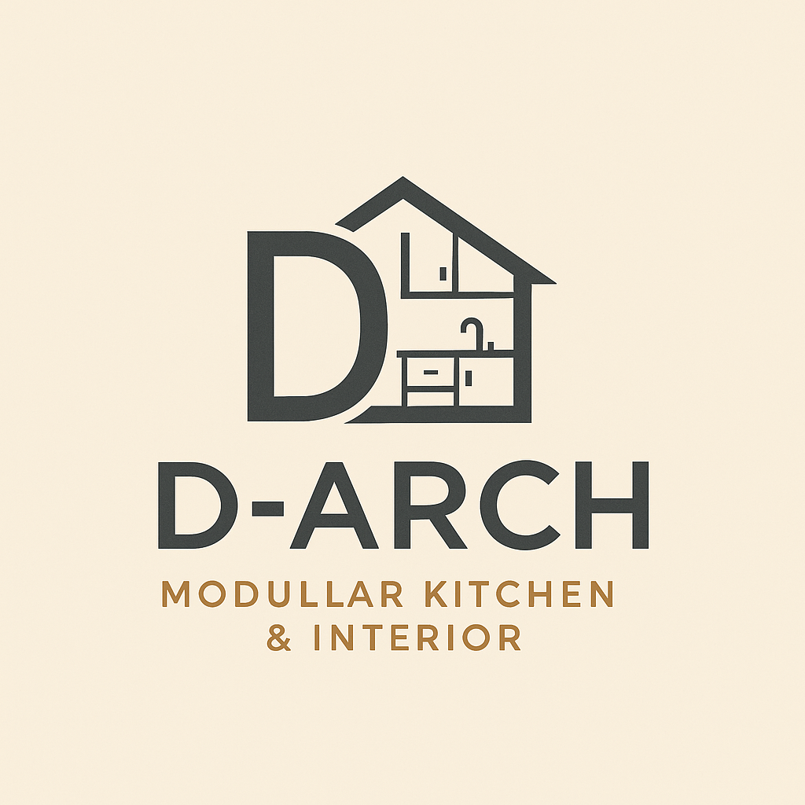

# D‑ARCH Modular Kitchen & Interior Website

Welcome to your complete website package for D‑ARCH Modular Kitchen & Interior!

## 📁 Package Contents

Your website includes the following files:

1. **index.html** - Home page with hero section and service overview
2. **about.html** - About us page with company story and mission
3. **services.html** - Detailed services page with clean list format
4. **gallery.html** - Project gallery with before/after slider
5. **reviews.html** - Customer testimonials and reviews
6. **contact.html** - Contact page with form and business information
7. **README.md** - This instruction file

## 🎨 Design Features

- **Modern, clean design** with your brand colors (White, Black, Orange #FF5722)
- **Responsive layout** that works on all devices
- **Professional Poppins font** throughout
- **Smooth animations and hover effects**
- **WhatsApp integration** with floating button
- **Monku the Desi Bandar chatbot** functionality
- **Real project photos** integration ready

## 📸 Required Images

To complete your website, you'll need these images in the same folder:

- `20250718_155325-COLLAGE.jpg` (your kitchen collage)
- `Picsart_25-06-24_18-43-38-543.jpg` (before/after comparison)
- `logo.png` (your company logo - optional)
- Client avatars: `client-avatar-1.jpg` through `client-avatar-6.jpg` (optional)
- `founder-placeholder.jpg` (founder photo - optional)

## 🚀 How to Deploy

### Option 1: Free Hosting (GitHub Pages)
1. Create a GitHub account at github.com
2. Create a new repository
3. Upload all HTML files and images
4. Go to Settings → Pages
5. Select main branch as source
6. Your site will be live at: `https://yourusername.github.io/repository-name`

### Option 2: Traditional Web Hosting
1. Purchase domain (like darchseoni.in)
2. Buy hosting from providers like Hostinger, Bluehost, etc.
3. Upload files via cPanel File Manager or FTP
4. Place files in public_html folder

### Option 3: Quick Test Locally
1. Save all files in one folder
2. Double-click index.html to open in browser
3. Test all navigation and features

## ✅ Pre-Launch Checklist

- [ ] All HTML files saved in same folder
- [ ] Your project images added to folder
- [ ] Company logo added (replace "D‑ARCH" text in header)
- [ ] Contact information verified
- [ ] WhatsApp number confirmed (+91 7509057442)
- [ ] Email address confirmed (darchmodular@gmail.com)
- [ ] All navigation links working
- [ ] Mobile responsiveness tested

## 🔧 Customization Options

### Update Your Logo
Replace the text "D‑ARCH" in the header with:
```html

```

### Add More Images
- Place additional project photos in the gallery
- Update image names in gallery.html

### Modify Contact Information
- Update phone numbers, email, and address in contact.html
- Change WhatsApp number in all pages
- Update social media links in footer

## 📱 Features Included

✅ **Professional Design** - Modern, clean, mobile-friendly
✅ **Contact Forms** - Email integration ready
✅ **WhatsApp Integration** - Direct chat buttons
✅ **Google Maps** - Seoni location embedded
✅ **Service Listings** - Comprehensive service details
✅ **Client Reviews** - Testimonial section
✅ **Project Gallery** - Before/after showcase
✅ **Monku Chatbot** - Fun Hindi-speaking guide
✅ **Social Media Links** - Facebook, Instagram, WhatsApp
✅ **Business Hours** - Operating time display
✅ **File Upload** - Floorplan submission form

## 🆘 Need Help?

If you need assistance with:
- Setting up hosting
- Uploading files
- Customizing content
- Adding more features

Contact us via WhatsApp: +91 7509057442

## 📝 Final Notes

This website is ready to launch and will help you:
- Attract customers in Seoni and surrounding areas
- Showcase your modular kitchen projects
- Generate leads through WhatsApp and email
- Build credibility with testimonials
- Provide easy contact methods for clients

**Your professional online presence is ready! 🎉**